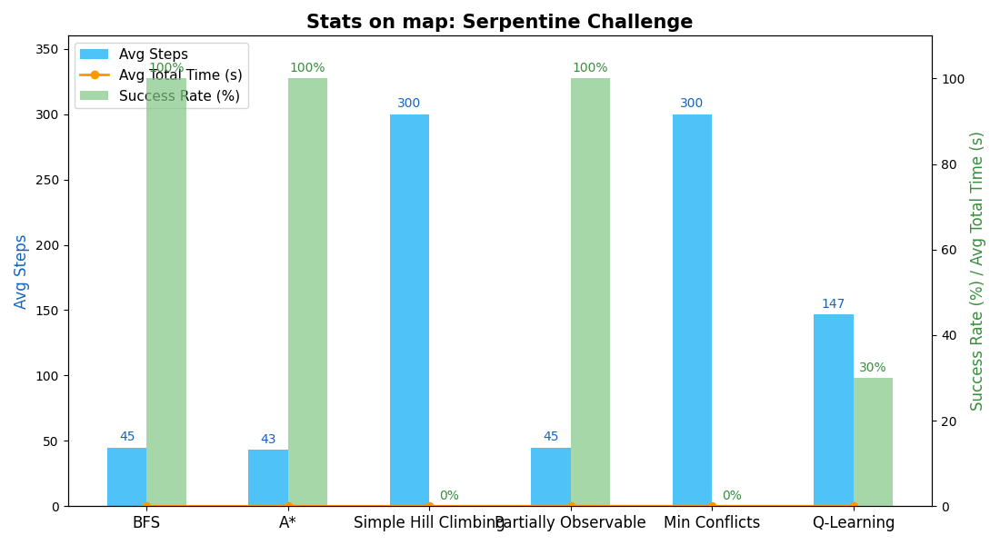
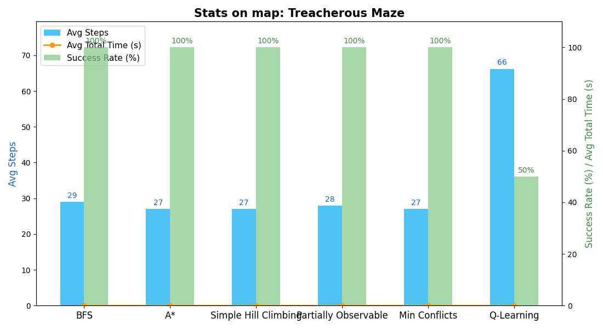
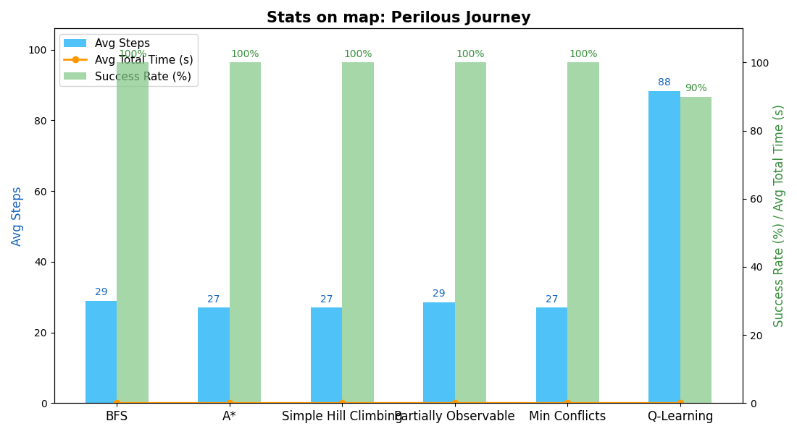

# Rescue Princess - AI Maze Game

## Mục tiêu dự án
Dự án xây dựng một trò chơi mê cung (maze game) trong đó **hiệp sĩ** sẽ áp dụng các **thuật toán tìm kiếm AI** để giải cứu công chúa. Mục tiêu chính là:
- Áp dụng các thuật toán tìm kiếm cổ điển và hiện đại của môn học Trí Tuệ Nhân Tạo để tìm đường đi tối ưu trong mê cung.
- Minh họa sự khác nhau giữa các chiến lược tìm kiếm trong một môi trường tương tác.
- Tăng cường trải nghiệm học tập thông qua trò chơi trực quan.

## Giới thiệu hệ thống trò chơi
- Người chơi điều khiển hiệp sĩ tìm và giải cứu công chúa, sau đó đưa công chúa đến cửa thoát hiểm.
- Chế độ AI sẽ tự động tìm đường đến công chúa và cửa thoát dựa trên thuật toán được chọn.
- Giao diện có các chức năng: lựa chọn độ khó, chọn thuật toán AI, quản lý bản đồ, xem thống kê AI, và hướng dẫn chơi.
- Có hiệu ứng âm thanh, đồ họa, hiển thị thông tin như số bước đi, thời gian, và ma trận sương mù trong chế độ khó.

## Các thuật toán tìm kiếm được triển khai

| Thuật toán | Mô tả |
|-----------|-------|
| **BFS (Breadth-First Search)** | Tìm đường đi ngắn nhất, đơn giản và hiệu quả trong mê cung không có trọng số. |
| **A\*** | Kết hợp giữa chi phí thực tế và ước lượng (heuristic), rất tối ưu cho tìm đường trong mê cung. |
| **Simple Hill Climbing** | Tối ưu cục bộ, đơn giản nhưng dễ rơi vào cực trị cục bộ; có cơ chế thoát khỏi cực trị cục bộ. |
| **Partially Observable** | Thuật toán đặc biệt cho môi trường chỉ quan sát được một phần, sử dụng phương pháp khám phá và khai thác. |
| **Min Conflicts** | Giải quyết vấn đề thoả mãn ràng buộc, tìm đường đi với ít xung đột nhất. |
| **Q-Learning** | Thuật toán học tăng cường, hiệp sĩ học cách tối ưu đường đi qua trải nghiệm trong môi trường. |

## Minh họa các thuật toán

### BFS (Breadth-First Search)


### A*


### Simple Hill Climbing


### Partially Observable


### Min Conflicts


### Q-Learning


## Cài đặt

### Yêu cầu
- Python 3.8+
- Pygame

### Cài đặt thư viện
```bash
pip install pygame
```

### Chạy trò chơi
```bash
python game.py
```

## Cách chơi
- **Di chuyển:** Sử dụng các phím mũi tên để di chuyển hiệp sĩ trong mê cung.
- **Mục tiêu:** Tìm và giải cứu công chúa (ô số 2), sau đó dẫn cả hai đến cửa thoát hiểm (ô số 3).
- **Tránh quái vật:** Nếu chạm vào quái vật, bạn sẽ thua cuộc.
- **Chế độ dễ:** Toàn bộ bản đồ, vị trí công chúa và cửa thoát hiểm đều hiển thị.
- **Chế độ khó:** Chỉ vùng đã khám phá mới hiển thị, tăng độ thử thách.

## Chế độ AI & Thống kê
- **Chọn AI:** Tại menu chính, chọn "AI PLAY" và thuật toán mong muốn.
- **Thống kê AI:** Nhấn nút "AI STATS" ở menu chính để xem thống kê chi tiết:
  - Thuật toán, số bước, thời gian, có cứu được công chúa hay không.
- **Lưu điểm:** Kết quả AI lưu ở `ai_score.txt`, người chơi lưu ở `player_scores.txt`.

## Quản lý bản đồ
- **File bản đồ:** Tất cả bản đồ nằm trong `maps.txt`.
- **Cấu trúc:** Mỗi bản đồ gồm tên (dòng đầu), tiếp theo là 16 dòng ma trận 16x16 (1: tường, 0: đường đi, 2: công chúa, 3: cửa thoát).
- **Thêm bản đồ:** Thêm tên bản đồ mới và ma trận vào cuối file 'maps.txt'.

## Cấu trúc dự án
```
Rescue-Princess-AI/
│
├── game.py              # File chính của trò chơi
├── images/              # Thư mục chứa hình ảnh game
├── sounds/              # Thư mục chứa âm thanh
├── assets/              # Thư mục chứa gif minh họa thuật toán
├── maps.txt             # Tệp chứa dữ liệu bản đồ
├── ai_score.txt         # Tệp ghi lại điểm của AI
├── player_scores.txt    # Tệp ghi lại điểm của người chơi
└── README.md            # Tài liệu hướng dẫn
```

## So sánh thống kê AI giữa các thuật toán và bản đồ

Dự án cung cấp chức năng **benchmark** để so sánh hiệu quả các thuật toán AI trên nhiều bản đồ khác nhau. Sau khi chạy benchmark, hệ thống sẽ tự động lưu lại các biểu đồ thống kê trong thư mục `benchmark/`. Các biểu đồ này giúp trực quan hóa sự khác biệt về số bước đi trung bình, thời gian hoàn thành và tỷ lệ thành công của từng thuật toán trên từng bản đồ.

### Ý nghĩa các chỉ số thống kê:
- **Avg Steps:** Số bước trung bình để hoàn thành nhiệm vụ.
- **Avg Steps to Princess:** Số bước trung bình để tìm đến công chúa.
- **Avg Steps Finish:** Số bước trung bình để hoàn thành bản đồ.
- **Avg Time to Princess:** Thời gian trung bình tìm đến công chúa.
- **Avg Time to Exit:** Thời gian trung bình từ công chúa đến cửa thoát.
- **Avg Total Time:** Tổng thời gian trung bình hoàn thành bản đồ.
- **Success Rate:** Tỷ lệ thuật toán hoàn thành nhiệm vụ thành công.

### Ví dụ so sánh các thuật toán trên bản đồ "Serpentine Challenge"



*Biểu đồ trên cho thấy sự khác biệt rõ rệt giữa các thuật toán về số bước đi, thời gian hoàn thành và tỷ lệ thành công trên bản đồ Serpentine Challenge.*

### So sánh trên các bản đồ khác

Bạn có thể chạy benchmark trên nhiều bản đồ khác nhau để đánh giá:
- Thuật toán nào tối ưu nhất về số bước đi và thời gian?
- Thuật toán nào ổn định nhất (tỷ lệ thành công cao)?
- Độ khó của từng bản đồ ảnh hưởng thế nào đến hiệu quả của từng thuật toán?

#### Ví dụ: So sánh trên bản đồ "Treacherous Maze"



#### Ví dụ: So sánh trên bản đồ "Perilous Journey"



> **Lưu ý:**  
> - Các file ảnh biểu đồ sẽ tự động sinh ra trong thư mục `benchmark/` mỗi khi bạn chạy benchmark.
> - Bạn có thể mở các file này để phân tích, báo cáo hoặc trình bày kết quả học tập.

---

*Chức năng thống kê và trực quan hóa giúp bạn dễ dàng đánh giá, lựa chọn thuật toán AI phù hợp cho từng loại mê cung, đồng thời nâng cao hiểu biết về ưu nhược điểm của từng phương pháp tìm kiếm.*

## Hướng phát triển
- Mở rộng thêm các thuật toán tìm kiếm nâng cao như Genetic Algorithm, IDA*, hoặc các thuật toán khác.
- Thêm chức năng tạo bản đồ ngẫu nhiên với độ khó khác nhau.
- Phát triển thêm nhiều loại quái vật với các chiến lược tìm đường khác nhau.
- Tối ưu hóa thuật toán cho môi trường phức tạp và mê cung lớn hơn.

## Thành viên nhóm
- 23110225 - Nguyễn Lâm Huy
- 23110278 - Bùi Phúc Nhân
- 23110355 - Phan Việt Tuấn

## Tài liệu tham khảo
- Russell, S., & Norvig, P. (2020). Artificial Intelligence: A Modern Approach (4th ed.). Pearson.
- Pygame Documentation: https://www.pygame.org/docs/
- Stuart J. Russell and Peter Norvig. 2010. Artificial Intelligence: A Modern Approach (3rd ed.). Prentice Hall Press, USA.

---
*Dự án mang tính học thuật cao, mô phỏng hệ thống trò chơi AI vào môi trường tương tác để nâng cao hiểu biết về thuật toán tìm kiếm.*
